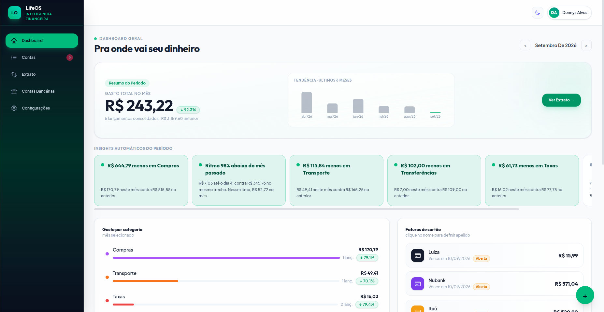
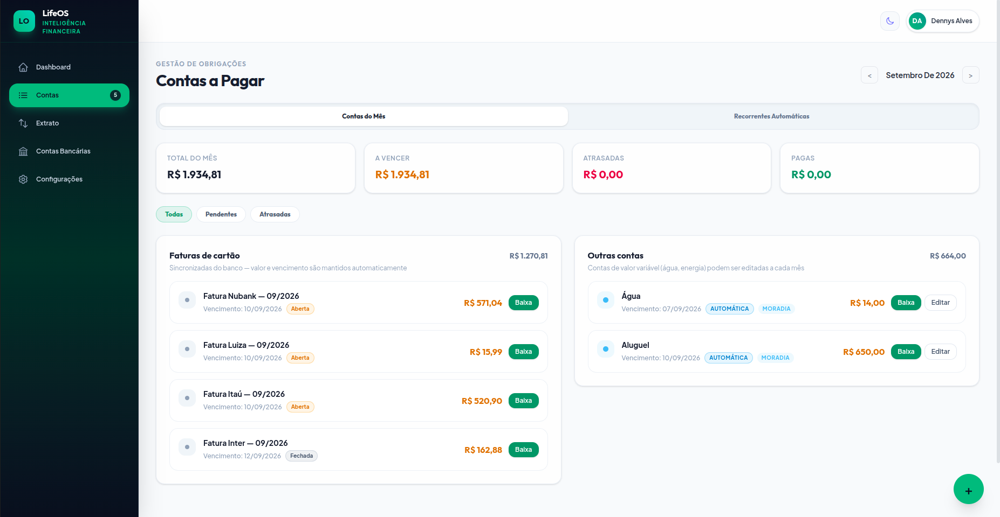
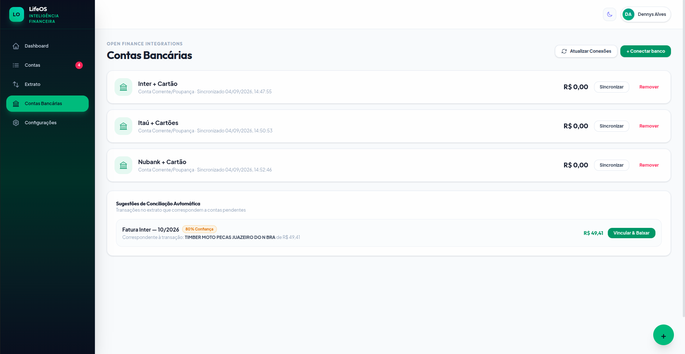

# LifeOS — Personal Finance Manager

[](https://github.com/dennys-swe/LifeOS/actions/workflows/ci.yml)

> Multi-tenant personal finance SaaS built to answer one question: **"Where is my money going?"**
> It connects to real bank accounts through Open Finance (Pluggy), tracks bills and credit-card
> invoices, reconciles transactions automatically, and surfaces month-over-month insights.

**Stack:** Python · FastAPI · SQLAlchemy 2.0 · PostgreSQL · React 19 · Vite · Tailwind CSS v4
**Live:** backend on Render · frontend on Vercel · database on Neon · ~255 automated tests (pytest)

---

## Screenshots

| Dashboard | Bills | Bank sync |
| :---: | :---: | :---: |
|  |  |  |

---

## Overview

LifeOS started as a manual bill-payment checklist and grew into a full personal-finance engine.
It links to real bank accounts (Itaú, Nubank, Inter and others) through the **Pluggy API**, then
unifies statements, credit-card invoices and recurring expenses into a single mobile-first dashboard.

Each user signs up, connects their own banks, and only ever sees their own data.

---

## Architecture

FastAPI layered backend: **Router → Service → SQLAlchemy ORM → PostgreSQL**.

| Layer | Technology | Hosting |
| :--- | :--- | :--- |
| Database | PostgreSQL (SQLAlchemy 2.0 + Alembic) | Neon |
| Backend | Python 3.11 · FastAPI · Pydantic v2 · `fastapi-users` (JWT) | Render |
| Frontend | React 19 · Vite · Tailwind CSS v4 · Recharts · react-router | Vercel |
| Open Finance | Pluggy API (OAuth via MeuPluggy proxy) | Open Finance BR |
| Uptime | `HEAD /` health check | UptimeRobot |

- **Multi-tenancy:** every data table carries a `user_id` FK; every service function filters by it.
  No `select(Model)` runs without `.where(Model.user_id == user_id)`.
- **Auth:** JWT bearer tokens via `fastapi-users`, with a custom sync SQLAlchemy adapter.
- **Tests:** pytest against in-memory SQLite — no external database needed to run the suite.

---

## Key features

### Open Finance & bank sync (Pluggy)
- Real bank connections through the **MeuPluggy** connector (personal use, no commercial license).
- Automatic sync of checking-account transactions and credit-card invoices.
- **Open vs. closed invoices:** the Bills API only publishes an invoice after it closes, and the
  delay varies per bank. The open cycle is *rebuilt from transactions* (forecast date, projected
  installments, currency conversion) and flagged as *Open*, then replaced by the official value.
- **Payable window:** only invoices due this month or next become payables, keeping far-future
  installment projections and stale invoices out of the list.

### Dashboard & insights
- Monthly spending hero with a percentage delta vs. the previous month.
- Rule-based insight feed (`GET /insights`): category spikes, biggest expenses, spending pace,
  budget-near-limit and over-budget alerts.
- Recharts trend series with per-category drill-down to the individual transactions behind a total.
- Per-card nickname and color, inherited by every invoice of that card and by future syncs.

### Reconciliation & categorization
- **Confidence scoring** between statement transactions and pending payables. The amount must
  match exactly (1.0 on the due date, 0.8 within ±7 days). Auto-reconciliation only fires for
  unique exact matches.
- **Directional category mapping:** the same Pluggy category means opposite things depending on
  whether money comes in or goes out (PIX sent is an expense, PIX received is income).
- **Keyword rules** that also apply retroactively to history the moment the rule is created.
- **Transfer handling (`is_transfer`):** money moving between your own accounts, investments and
  invoice payments is isolated from spending totals to avoid double counting.

### Bills & recurring
- Status tracking (pending, paid, overdue) with optimistic delete and toast-based undo.
- Each payable knows its origin (invoice, recurring template, or manual) and adjusts which
  actions it offers accordingly.
- Recurring templates generate monthly obligations without duplication; new templates are
  suggested automatically from statement history.

### PWA & notifications
- Installable PWA on iOS and Android with service workers.
- Native push notifications (VAPID) for bills coming due.

---

## Data model

| Model | Purpose |
| :--- | :--- |
| `User` | Account (`fastapi-users`): email, hashed password, status |
| `Payable` | A single bill; FKs to `recurring_payable_id` and `transaction_id` |
| `RecurringPayable` | Monthly recurrence template (title, amount, day of month) |
| `Transaction` | Bank statement or imported transaction (`is_transfer`, `external_category`) |
| `CreditCardBill` | Invoice with `OPEN`/`CLOSED` status, per-card nickname and color |
| `Category` | Category with color and `kind` (`EXPENSE`/`INCOME`), per user |
| `CategoryRule` | Keyword categorization rule with priority |
| `Budget` | Monthly per-category budget |
| `BankAccount` | Bank connection via Pluggy |
| `PushSubscription` | VAPID subscription for push notifications |

---

## Engineering notes

- **Timezone safety:** dates travel and are stored strictly as `YYYY-MM-DD` strings; `new Date(str)`
  is never used on the frontend (GMT offset shifts the day).
- **Transfer isolation:** detection checks both the Pluggy category *and* the description — in real
  data, 13 invoice payments arrived as a generic `Transfers` category and were double-counting
  ~6% of monthly spending.
- **Transaction type comes from Pluggy's `type` field, never the amount sign** — on credit cards a
  purchase arrives positive, so sign-based inference flipped more than half of real transactions.
- **Warmup:** the root route answers `HEAD` requests so UptimeRobot keeps the Render container warm
  and eliminates cold starts.

---

## Running locally

**Prerequisites:** Python 3.11+, Node.js 18+

```bash
# Backend
cd backend
cp .env.example .env          # set DATABASE_URL, SECRET_KEY, Pluggy credentials, VAPID keys
pip install -r requirements.txt
alembic upgrade head
uvicorn app.main:app --reload

# Frontend
cd frontend
npm install
npm run dev                   # http://localhost:5173

# Tests
cd backend && pytest          # ~255 tests on in-memory SQLite
cd frontend && npm test
```

---

## Further documentation

- **[CLAUDE.md](./CLAUDE.md)** — full architecture, code conventions, deploy routines and business rules.
- **[BACKLOG.md](./BACKLOG.md)** — open items, with the reasoning behind each.

---

*Built by Dennys Alves Silva — [linkedin.com/in/dennysdev](https://linkedin.com/in/dennysdev) · [github.com/dennys-swe](https://github.com/dennys-swe)*
